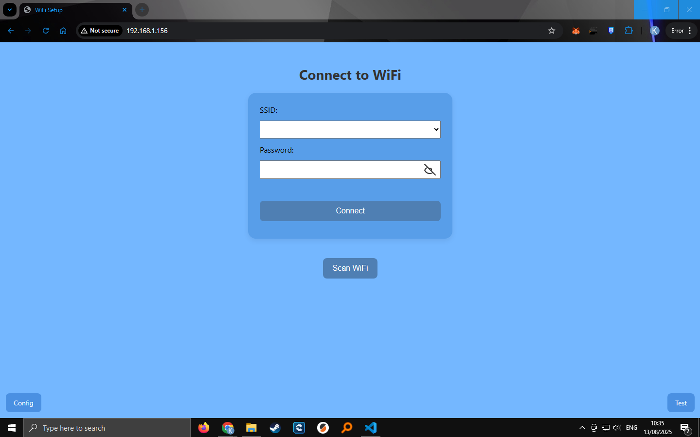
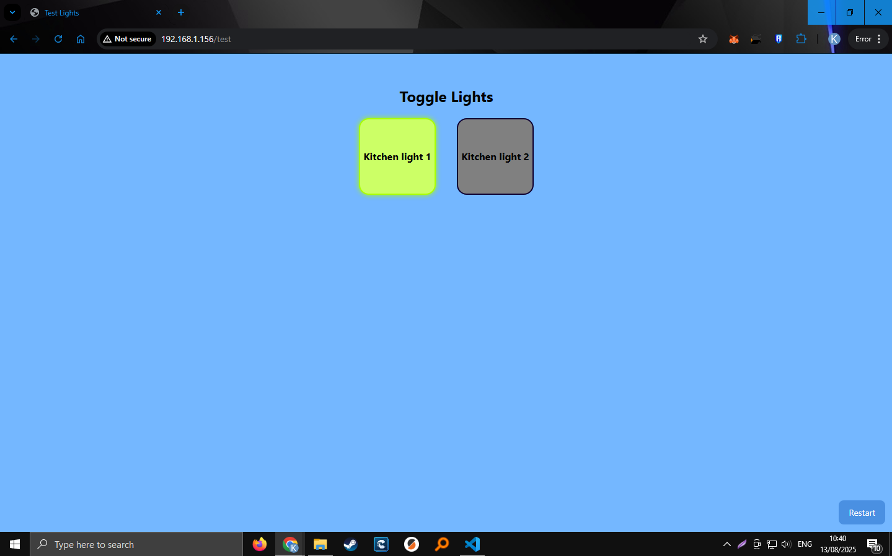

# Smart AI Home Assistant Device Controller (ESP32)

This project is an **ESP32-based smart home device controller** designed to be used with a local or cloud-based AI assistant.  
It allows you to control multiple devices (like lights) via:
- A **built-in web interface**
- **REST API endpoints** for integration with AI/automation systems
- **Wi-Fi setup and persistence** (credentials saved in flash memory)
- **Device name & custom light names**
- **Multiple device support** (configurable number of lights)

---

## Features

- **Wi-Fi Credential Storage** – Save Wi-Fi credentials so the ESP32 reconnects automatically.
- **Access Point Mode** – Starts its own Wi-Fi network if it cannot connect to saved credentials.
- **Custom Device Name** – Identify the ESP32 uniquely in your AI assistant.
- **Multiple Device Control** – Set the number of devices/lights to manage (up to `MAX_LIGHTS`).
- **Persistent Light States** – Lights return to their last state after reboot.
- **Device Test Page** – Web UI to toggle devices on/off.
- **REST API Endpoints** – Easy integration with Python backend or home automation tools.
- **Automatic Reconnect** – Detects Wi-Fi dropouts and attempts reconnection.

---

## Hardware Requirements

- **ESP32 board** (e.g., ESP32-WROOM-32)
- Up to `MAX_LIGHTS` output devices (relays, LEDs, etc.)
- Connected to GPIO pins as defined in the code:
```

int lightPins\[MAX\_LIGHTS] = {2, 4, 5, 18};

```

---

## Web Pages

1. **Wi-Fi Setup Page** – Configure and save your Wi-Fi credentials.
2. **Device Setup Page** – Set device name, number of devices, and light names.
3. **Device Test Control Page** – Toggle each light/device ON or OFF from a simple UI.

---

## Step-by-Step Setup

### 1️⃣ Upload the Code
- Install [Arduino IDE](https://www.arduino.cc/en/software).
- Install **ESP32 board support** via the Boards Manager.
- Install required libraries:
- `ESPAsyncWebServer`
- `ArduinoJson`
- `Preferences`
- Flash the code to your ESP32.

---

### 2️⃣ Initial Connection
1. Power on the ESP32.
2. If no Wi-Fi credentials are stored, the ESP32 will start in **Access Point (AP) mode**.
3. Look for a Wi-Fi network called:
```

Smart Light

```
Password:
```

12345678

```
4. Connect to it and go to `http://192.168.4.1` in your browser.

---

### 3️⃣ Set Up Wi-Fi
- Enter your **home Wi-Fi SSID** and **password**.
- The ESP32 will connect and save these credentials for next time.
- If successful, it will switch to **Station Mode** and connect to your router.

---

### 4️⃣ Configure Devices
- Navigate to the **Device Setup** page (URL will depend on your network IP).
- Set:
- Device name
- Number of devices/lights (4 devices max)
- Custom names for each light
- Settings are stored in flash memory.

---

### 5️⃣ Control Devices
- Go to `/test` on your ESP32’s IP.
- You’ll see a grid of your devices.
- Click a device to toggle it **ON** or **OFF**.

---

## REST API Reference

### **Get Device Info**
```

GET /id

````
Returns:
```json
{
  "device": "esp-light",
  "lights": [
    { "name": "Light 1", "api": "/Light 1/toggle" },
    { "name": "Light 2", "api": "/Light 2/toggle" }
  ]
}
````

---

### **Get Light States**

```
GET /status
```

Returns:

```json
{
  "states": [
    { "name": "Light 1", "state": "on" },
    { "name": "Light 2", "state": "off" }
  ]
}
```

---

### **Toggle a Light**

```
POST /<Light Name>/toggle
Content-Type: application/json

{ "action": "on" }
```

or

```json
{ "action": "off" }
```

---

### **Temporary Toggle (No Save)**

```
POST /testToggle
Content-Type: application/json

{ "light": 0, "action": "on" }
```

---

### **Update Wi-Fi Credentials**

```
POST /newWiFiCredentials
Content-Type: application/json

{ "ssid": "YourSSID", "password": "YourPassword" }
```

---

## Example Workflow with AI Assistant

1. The AI assistant sends a GET request to `/id` to discover available devices.
2. It uses `/status` to check the state of devices.
3. It sends a POST request to `/<Light Name>/toggle` to control them.
4. The ESP32 updates instantly and saves the new state.

---

## Sample Images

| Wi-Fi Setup Page                     | Device Test Page                   |
| ------------------------------------ | ---------------------------------- |
|  |  |

---

## License

MIT License – Feel free to modify and use in your own projects.

---
